# Ideation Plugin

> 🌱 **[ideation.engineering](https://ideation.engineering/)** — the pitch, install, and an illustrated walkthrough of the whole loop.
>
> 📖 **[ideation.engineering/guide](https://ideation.engineering/guide/)** — which command to run for your situation, what each one writes, and the five gates the interview will not skip.
>
> 📓 **[CHANGELOG.md](CHANGELOG.md)** — what shipped in each release, newest first.

Transform brain dumps into structured implementation artifacts through a conversational interview. HTML is used for interactive decision-making (the contract with evidence-gate readiness, visual comparisons during the interview). Markdown is used for reference documents (specs, PRDs) consumed directly by `/ideation:execute-spec`. Includes an execution workflow for implementing specs in fresh sessions with per-component feedback loops, adversarial plan critics, a Scout/Reviewer agent pipeline, and a push-based learning loop that captures lessons at completion and applies them visibly at future intakes.

## Skills

The arc runs **chart → whether → how → shipped**: chart finds the route when an effort is too big for one session and the route itself is unknown, brainstorm decides whether the idea is worth building, ideation plans how, and the execution commands below ship it.

### chart

For efforts too big for one agent session and wrapped in fog — the way from here to the destination isn't visible yet, so a single ideation contract is the wrong shape. Chart lays out a **shared local map** of **decision tickets** (markdown files under `docs/chart/{slug}/`), then works them one at a time — one per session, except research — until the route is clear. Each ticket resolves a *decision*, not a slice of a build; the map is done when nothing is left to decide before someone goes and does the thing.

```
/ideation:chart

[a loose, too-big idea where you can't yet see the route]
```

**The model:** a map (`map.md`) is the canonical index — Destination, Notes, Decisions so far, Not yet specified (the fog of war), Out of scope. Tickets are files in `tickets/` with a `Type` (research / prototype / grilling / task), `Status`, `Claimed by`, and `Blocked by`. The frontier is the open, unblocked, unclaimed tickets. Research tickets resolve via an `Explore` subagent (AFK, parallel in the charting session); prototype tickets raise a cheap concrete artifact to react to; grilling tickets are one-question-at-a-time conversation (the same interview-engine sections brainstorm uses); task tickets are manual work that unblocks a decision. Resolving a ticket clears the fog ahead of it, graduating newly-specifiable questions into fresh tickets until the frontier is empty.

**Plan, don't do** is the default — chart produces decisions, not deliverables. When the destination is a build, it hands off to `/ideation:ideation` with the route walked as the intake evidence (destination, route/decisions, rejected alternatives, out-of-scope), so ideation's interview starts at the open questions. Already can see the route? Skip to ideation. Still weighing whether to build at all? Use brainstorm.

Full behavior lives in [skills/chart/SKILL.md](skills/chart/SKILL.md).

### brainstorm

Pressure-test whether an idea is worth building at all — "should I do X," "which of these approaches," "am I overthinking this." Runs entirely in conversation: no files, no gates, no spec. When the answer is "yes, build it," it hands off to the ideation interview with what you settled as the starting point.

**How to invoke:**

```
/ideation:brainstorm

[the idea or decision you're weighing]
```

Full behavior lives in [skills/brainstorm/SKILL.md](skills/brainstorm/SKILL.md). Already decided to build? Skip straight to ideation. Too big to see the route? Start with chart.

### ideation

Transforms raw, unstructured brain dumps (dictated freestyle) into actionable implementation artifacts through an evidence-gated workflow.

Use this before building any new feature, planning a migration, designing a system, or turning scattered ideas into a plan. Covers small single-spec projects through multi-phase initiatives.

**How to invoke:**

```
Use the ideation skill

[provide your brain dump - messy dictation, scattered thoughts, half-formed ideas]
```

Or simply start with your brain dump and mention you want to turn it into specs:

```
I want to build something. Here's what I'm thinking...

[your raw, unstructured thoughts]

...can you help me turn this into a spec?
```

**The workflow:**

1. **Intake** - Accept your messy, unstructured input without judgment. Take a position upfront — what's strong, what's weak. On an existing codebase, fire a parallel exploration sweep so the first question is already informed.
2. **Interview loop** - One question at a time, each with a recommended answer. Explores the codebase inline — if it can look something up instead of asking, it does. Challenges vague demand, undefined terms, and hypothetical users. Loops until all 5 evidence gates are `ready`.
3. **Contract** - When all 5 gates are `ready`, four plan critics stress-test the plan in parallel; then generate `contract.html` via the contract-gen CLI. A flight strip of the deciding measurements, the gate readiness board, nested scope tiers (MVP / Full / Stretch), an interactive phase graph, the run model, and copyable execution commands. Pick your scope tier in the terminal. Includes revision lineage tracking via `Supersedes` link.
4. **HTML visualizations** - During interview and phasing, decisions default to inline `AskUserQuestion` previews; ephemeral HTML pages (comparisons, mockups, architecture options) are reserved for decisions that need real visual rendering. Deleted after you choose.
5. **Phasing & specs** - Determine phases, generate Markdown specs with feedback loops and failure mode catalogs
6. **Feedback quality check** - Self-review specs for feedback loop coverage before presenting
7. **Execution handoff** - Phase track in contract, copy-to-clipboard ideation commands

**Output artifacts:**

All artifacts are written to `./docs/ideation/{project-name}/`:

```
_comparison.html               # Ephemeral decision aid (deleted after choice is made)
contract-data.json             # Machine-readable contract (source of truth; consumed by autopilot)
contract.html                  # the contract (for review)
contract.md                    # Plain contract (autopilot fallback when contract-data.json is absent)
contract-{date}.html / .md     # Superseded revisions (lineage chain)
prd-phase-1.md                 # Phase 1 requirements (only if PRDs chosen)
spec-phase-1.md                # Implementation spec (for execute-spec)
spec-template-{pattern}.md     # Shared template for repeatable phases (if applicable)
spec-phase-N.md                # Per-phase delta or full spec
context-map.md                 # Scout's codebase map (written during execution)
implementation-notes-phase-1.html  # Decisions made during execution (per-phase)
run-{date}.json                # Machine-readable run record — one per engine run
run-{date}.html                # Self-contained run report; warnings lead
```

Autopilot writes the `run-{date}.json` / `.html` pair as soon as the engine returns — before its failure gate, so a halted or walked-away run still leaves its review findings behind — and re-renders it once `scripts/verify.mjs` has run.

HTML artifacts (contract, implementation notes, run reports, ephemeral visualizations) are self-contained single files with all CSS/JS inlined — no external dependencies. They open in your browser automatically. Features include:

- **Field-guide layout** — one scrolling document: masthead, flight strip, banded sections, and a running head that carries the run command once you scroll past it (no tabs, no framework, no CDN)
- **Readiness gate checklist** — a ✓/✗ per dimension with its one-sentence evidence citation in the hero (no score; readiness is binary)
- **Success criteria with checks** — each criterion carries a typed check: `{cmd, expect}` renders the verifying command with its expected outcome, `{judgment}` renders a visible "judgment call" tag naming who looks at what. `scripts/verify.mjs <contract-data.json>` executes every `cmd` and prints a machine-readable `VERIFY {slug}: commits=A/B pass=N fail=M judgment=K` line (exit 0 = the contract's completion predicate; it verifies one contract's acceptance checks, never repo health)
- **Decision log** — a "Decisions considered and rejected" panel recording interview rejections and critic-blocker fixes; carried into every spec so executors and reviewers can catch rejected approaches re-proposed as deviations
- **Nested scope tiers** showing MVP / Full / Stretch commitment levels
- **Horizontal phase track** with risk coloring and gate support
- **Draft/Approved lifecycle** — a Draft contract shows the phase track as a plan preview with an "awaiting approval" note; run commands appear only once the contract is Approved (Phase 5)
- **Copy-to-clipboard buttons** on `/ideation:autopilot` and per-phase commands (Approved contracts)
- **Dark-first theming** with a co-equal light theme — auto/light/dark toggle persisted in `localStorage`; auto follows system preference

Specs and PRDs are Markdown — readable as-is and consumed directly by `/ideation:execute-spec`.

**Bundled references:**

Shared (`references/`):

- `interview-engine.md` - Shared interview engine (Phases 1-2), including the intake exploration sweep
- `confidence-rubric.md` - Evidence-gate criteria for readiness assessment and spec feedback quality
- `feedback-loop-guide.md` - Component-type mapping and design criteria for feedback loops
- `harness-compat.md` - Claude Code / pi harness translation matrix
- `learning-filter.md` - The learnings.md lifecycle: classify, generalize, dedupe, retire

Skill-specific:

- `html-guide.md` - components and constraints for ephemeral comparison/visualization artifacts (`contract.html` is rendered only by `scripts/contract-gen.ts`)
- `prd-template.md` - PRD template
- `spec-template.md` - Implementation spec template (includes feedback loops and failure modes)

### express

One-pass ideation for well-understood work: `/ideation:express` runs the identical evidence-gated interview, then collapses the four post-interview approval gates (contract approval, PRDs-vs-specs, spec approval, run-mode choice) into a single informed confirmation and goes straight to execution.

```
/ideation:express

[provide your brain dump]
```

**What stays from the full flow:** the entire interview (no question limit, same gates), the four plan critics, and every artifact — `contract-data.json`, `contract.html`, `contract.md`, and specs are all still generated for post-hoc review.

**What changes:**

- **Two hard preconditions**, checked when the interview ends: all 5 gates `ready` (an early-stopped interview falls back to the standard flow) and a majority of success criteria carrying `cmd` checks — read from the generator's printed `{N} criteria ({M} cmd, {K} judgment)` count, since unattended execution can only trust what `verify.mjs` checks mechanically. Failing either routes to the standard ideation flow — never a silent downgrade.
- **One confirmation**, led by the success-criteria check commands (approve what "done" means, not the essay), plus scope-tier contents and the critic digest. Answering it is the approval.
- **Isolation branch.** Execution commits to `ideation/{slug}`; review moves to the branch diff. A bad run is a deleted branch, not a revert (autopilot's git-log skip pre-pass would treat reverted phase commits as complete).
- **Fail-closed execution.** `approvalMode: "express"` → engine `strict: true` → `/ideation:execute-spec --headless --strict`.

Not for exploratory or unfamiliar territory — the full flow's review gates earn their keep there.

## Interview Loop

The core of the skill is a relentless one-question-at-a-time interview that builds shared understanding before writing anything. Key behaviors:

- **One question at a time** — no batching 3-5 questions. Ask, wait, ask next.
- **Recommended answer with every question** — the agent takes a position and lets you agree or redirect.
- **Explore instead of asking** — if the codebase can answer a question, the agent looks it up rather than asking you.
- **No question limit** — keeps interviewing until shared understanding. Say "stop" or "wrap up" to end early.
- **Anti-sycophancy** — banned phrases ("That's an interesting approach", "That could work") replaced with direct positions. Challenges vague demand, undefined terms, and hypothetical users.

## Failure Modes

Specs now include a **Failure Modes** section that catalogs how each non-trivial component can fail:

| Column       | Purpose                          |
| ------------ | -------------------------------- |
| Component    | Which component                  |
| Failure Mode | Named failure (not just "error") |
| Trigger      | What causes it                   |
| Impact       | What happens to user/system      |
| Mitigation   | How to handle or acknowledge     |

Trivial components (config, types, constants) skip failure mode enumeration — same rule as feedback loops.

## Implementation Notes

During execute-spec, the agent keeps a running `implementation-notes-phase-{N}.html` log of decisions it made that weren't covered by the spec — spec gaps, deviations, tradeoffs, codebase surprises, and dependency mismatches. Each entry records what the spec said (or didn't), what the agent chose, and what it rejected.

One file per phase. Opens in your browser automatically after execution. If the agent followed the spec without any judgment calls, no file is created.

## Open Questions and Resuming

An interview doesn't always get to close every gate in one sitting. Some gates are blocked on work the interview can't do: a fact nobody in the room has, something that has to be built before it can be judged, a decision waiting on input that doesn't exist yet, or an errand someone has to run.

When that happens the gate stays `not-ready` and the contract records the **open question** that would close it, each carrying the gate it blocks, how it closes (`research`, `prototype`, `decision`, `task`), and any other questions it waits on. A gate blocked on a written open question is a legitimate stopping point, so the session ends with a contract instead of looping on a question it can't answer.

Point ideation at that project again and it resumes: gates already `ready` are not re-interviewed, and it asks only the open questions whose blockers have closed.

```
Resuming Bookmark Garden: 3/5 gates ready — 2 open questions
```

A question only gets written if you can phrase it precisely enough to hand to someone else unchanged. Anything vaguer leaves the gate `not-ready` with the gap named in its evidence, and no question.

## Contract Lineage

Contracts track revision history via a `Supersedes` link. When re-running ideation on the same project, the prior **Approved** `contract.html` is renamed to `contract-{date}.html` (and the sibling `contract.md` to `contract-{date}.md`) and the new contract references it, creating a traceable revision chain. Draft contracts are replaced in place — interview revisions and the same-session Draft→Approved flip don't accumulate snapshot files; only approved commitments earn lineage.

Lineage and resuming answer different questions: lineage records that a commitment changed, resuming picks up an interview that never finished. A Draft with open questions is the second case, so re-entering it replaces the draft rather than snapshotting it.

## Evidence Gates

Readiness is no longer a number. The skill judges your brain dump across 5 **gates**, each either `ready` or `not-ready`. A gate is `ready` only when a concrete artifact exists — a goal written as a pass/fail statement, an explicit scope boundary — not when a score is asserted.

| Gate             | Gate question                                                             |
| ---------------- | ------------------------------------------------------------------------- |
| Problem Clarity  | Do I understand what problem we're solving, who has it, and why it matters? |
| Goal Definition  | Are the goals specific and measurable?                                    |
| Success Criteria | Can every stated goal be checked pass/fail today?                         |
| Scope Boundaries | Do I know what's in and out of scope?                                     |
| Consistency      | Are there contradictions I need resolved?                                 |

**Proceed-to-contract rule:** all 5 gates `ready`, _or_ the user explicitly ends the interview ("stop" / "wrap up") — in which case the `not-ready` gates are recorded as such in the contract. Each gate carries a one-sentence `evidence` citation: the artifact that makes it ready, or the gap that keeps it not-ready.

Judgment is deliberately conservative — when unsure whether the evidence is sufficient, the gate is `not-ready`. One extra question costs seconds; a bad contract costs hours.

The contract HTML renders these as a per-gate ✓/✗ evidence checklist in the hero — there is no aggregate score, because a contract normally only exists when every gate is ready. The full criteria live in `confidence-rubric.md`.

## Plan Critics

Before the contract renders, four adversarial critics review the plan in parallel — while a blocker is still a one-line `contract-data.json` edit rather than a regenerate-review-regenerate loop:

| Lens                | Looks for                                                       |
| ------------------- | --------------------------------------------------------------- |
| `scope-creep`       | Scope items that should be a tier lower (or out of scope)       |
| `over-engineering`  | In-scope features built with more structure than the goal needs |
| `hidden-dependency` | Phases that depend on work an earlier phase doesn't deliver     |
| `success-criteria`  | Goals that can't actually be checked pass/fail                  |

Each critic returns `blocker` / `notable` / `nit` findings. Blockers are folded into the contract before it renders; notables are folded in if clearly right, otherwise dismissed with a reason; nits are mentioned only. A **Critic digest** appears at the approval gate so you can see the plan was stress-tested. Critics run **once** per contract and never block it — a failed or unregistered critic logs a warning and proceeds without that lens.

## Learning Loop

The learning loop is push-based — it comes to you; there is no command to remember. When a watched run completes, the just-finished project's implementation notes pass through the generalization filter in `references/learning-filter.md`; up to 3 candidates survive, and one accept/edit/dismiss question decides what lands in the repo-level `docs/ideation/learnings.md`. The store is meant to be committed and shared with the repo — if the repo ignores `docs/ideation/`, un-ignore that one file (this repo's `.gitignore` does exactly that), or it stays machine-local. Zero candidates means zero prompts — a clean run stays silent. Unattended runs never write learnings; the next interactive interview intake spots their unmined notes with a bounded scan and offers once to mine them. When a recorded learning shapes an interview question or a spec implication, the interview says so visibly: `Applying learning from {project} ({date}): {why}`.

## Feedback Loops

Specs now include per-component feedback loops so the executing agent validates its work _during_ implementation, not just after.

Each spec defines a **Feedback Strategy** (top-level inner-loop command and playground type), and each iterative component gets:

- **Playground** - Environment to interact with (test suite, dev server, storybook, script harness)
- **Experiment** - Parameterized check with specific inputs and edge cases
- **Check command** - Fastest single validation, runs in seconds

Component types map to feedback mechanisms:

| Component Type         | Feedback Mechanism         |
| ---------------------- | -------------------------- |
| Data/logic layers      | Test file                  |
| UI components          | Dev server or Storybook    |
| API endpoints          | curl/httpie script         |
| CLI tools              | The tool itself            |
| Config/types/constants | Skip (typecheck covers it) |

Trivial components (config, types, constants) correctly skip feedback loops. The spec quality is self-reviewed (Strong/Adequate/Weak) before presentation.

## Example

**Input (messy dictation):**

```
okay so i'm thinking about this feature where users can like save their
favorite items you know like bookmarking but also they should be able to
organize them into folders or something maybe tags actually tags might be
better because folders are too rigid and oh we should probably have a
search too...
```

**Process:**

1. Skill accepts input, takes a position: "Strong: clear core feature. Weak: 'tags over folders' is preference, not evidence."
2. Interviews one question at a time with recommendations: "I'd scope this to articles — your app already has an Article model. Does that match?"
3. Explores codebase inline — finds existing tag system, recommends reusing it instead of asking
4. Challenges assumptions: "Have users complained about folders, or is this your gut?"
5. All 5 evidence gates reach `ready` after ~5 questions
6. Four plan critics stress-test the plan; then generates `contract.html` via contract-gen CLI — flight strip, gate readiness board, nested scope tiers, interactive phase graph, run model, and copyable execution commands. Pick your scope in the terminal.
7. After approval, asks: "Straight to specs or PRDs first?"
8. At decision points (phasing, orchestration), opens side-by-side visual comparisons in browser
9. Generates Markdown specs with feedback loops and failure modes

**Result:** an HTML contract for reviewing the plan, plus Markdown specs ready for `/ideation:execute-spec`.

**Prefer to watch it happen?** The [ideation site](https://ideation.engineering/) walks one fictional feature — a bookmark garden — through the whole loop as an animated, self-contained page: the interview scoreboard, the plan critics, the routing fork, execution waves, and the learning the next interview inherits. After cloning, `cd site && pnpm dev` serves both pages at `localhost:4321`. The command reference lives at [ideation.engineering/guide](https://ideation.engineering/guide/).

**Prefer to read the artifacts?** [`test-fixtures/orchestration/`](test-fixtures/orchestration/) is a full synthetic contract plus specs you can read without running anything — the dependency graph is the point — and [`skills/ideation/examples/`](skills/ideation/examples/) holds a worked contract, PRD, and spec. For a real run, unedited: [`docs/ideation/ux-dejank/`](docs/ideation/ux-dejank/) is the archived dogfood project that de-janked this plugin's own UX — contract, specs, gate evidence, and implementation notes exactly as the run produced them, reds and all (the archive's README explains the reds).

## Full Workflow Diagram

```mermaid
flowchart TD
    subgraph IDEATION["<b>Ideation Skill</b> — Planning"]
        A["🧠 Brain Dump<br/><i>messy thoughts, dictation,<br/>scattered ideas</i>"] --> B["Take Position<br/><i>what's strong, what's weak</i>"]
        B --> C{"5 Evidence<br/>Gates Ready?"}
        C -->|"Not yet"| D["Interview Loop<br/><i>one question at a time,<br/>recommended answer,<br/>explore codebase inline</i>"]
        D --> C
        C -->|"All ready"| CR["Plan Critics<br/><i>scope-creep, over-engineering,<br/>hidden-dependency, success-criteria<br/>— parallel</i>"]
        CR --> E["Generate Contract<br/><i>gate evidence, scope tiers,<br/>phase graph, run model</i>"]
        E --> F{"User<br/>Approval<br/>(pick scope tier,<br/>see critic digest)"}
        F -->|"Needs changes"| E
        F -->|"Approved"| G{"PRDs or<br/>straight to specs?"}
        G -->|"PRDs first"| H["Generate PRDs"] --> I
        G -->|"Straight to specs"| I["Generate Specs<br/><i>with feedback loops</i>"]
        I --> J["Self-Review<br/>Feedback Quality"]
        J -->|"Weak"| I
        J -->|"Strong/Adequate"| K["Write Execution Plan<br/><i>phase track,<br/>commands</i>"]
        K --> L["📄 Artifacts in<br/>docs/ideation/project/"]
    end

    L -->|"fresh session"| M

    subgraph EXECUTE["<b>Execute-Spec Skill</b> — Implementation"]
        M["Load Spec"] --> N["🔭 Scout Agent<br/><i>read-only subagent</i>"]

        subgraph SCOUT["Scout — Codebase Learning"]
            N --> N1["Read spec + pattern files"]
            N1 --> N2["Explore: dependencies,<br/>conventions, test infra"]
            N2 --> N3{"Scope ready<br/>AND ≥ 4/5<br/>gates ready?"}
            N3 -->|"Below bar, round 1"| N2
            N3 -->|"Below bar, round 2"| N4["HOLD — escalate<br/>to user"]
            N3 -->|"GO"| N5["GO — return<br/>context map"]
        end

        N4 --> N6{"User<br/>choice"}
        N6 -->|"Proceed anyway"| O
        N6 -->|"Update spec"| M
        N6 -->|"Abort"| STOP["⏹ Stop"]
        N5 --> O["Write context-map.md"]
        O --> P["Parse Spec +<br/>Create Tasks"]
        P --> Q["Set Up Feedback<br/>Environment"]

        subgraph BUILD["Build Phase — Per Component"]
            Q --> R["Claim task"]
            R --> S["Read before writing<br/><i>consult context map</i>"]
            S --> T["Set up feedback loop<br/><i>playground + check cmd</i>"]
            T --> U["Build incrementally"]
            U --> V{"Check<br/>passes?"}
            V -->|"No"| W["Fix + re-check"] --> V
            V -->|"Yes"| X["Run experiment<br/><i>edge cases</i>"]
            X --> Y["Complete task"]
            Y --> Z{"More<br/>tasks?"}
            Z -->|"Yes"| R
        end

        Z -->|"All done"| AA

        subgraph REVIEW["Verify-Review-Fix Loop"]
            AA["▶ Verify<br/><i>typecheck, lint,<br/>tests, build</i>"]
            AA --> AB{"Verify<br/>passes?"}
            AB -->|"No"| AC["Fix validation errors"] --> AA
            AB -->|"Yes"| AD["📋 Reviewer Agent<br/><i>reads git diff + spec</i>"]

            subgraph REVIEWER["Reviewer — Spec-Aware Review"]
                AD --> AD1["Compare diff vs spec"]
                AD1 --> AD2["Check: spec-deviation,<br/>pattern-mismatch,<br/>logic, security,<br/>performance, testing"]
                AD2 --> AD3["Produce structured<br/>findings"]
                AD3 --> AD4{"Zero critical<br/>+ high?"}
            end

            AD4 -->|"PASS"| AE["✅ Commit"]
            AD4 -->|"FAIL, cycle < 3"| AF["Fix critical/high<br/>findings"]
            AF --> AA
            AD4 -->|"FAIL, cycle = 3"| AG{"User<br/>escalation"}
            AG -->|"Fix manually"| STOP2["⏹ User fixes"]
            AG -->|"Accept with issues"| AE
            AG -->|"Abort"| STOP3["⏹ No commit"]
        end

        AE --> AH["📊 Completion Report<br/><i>review summary,<br/>validation results,<br/>acceptance criteria</i>"]
    end

    AH -->|"next phase"| M

```



### Reading the Diagram

**Ideation (left/top)** — brain dump → evidence-gated questioning → plan critics → contract → specs → execution plan. Human approves at each gate.

**Execute-Spec (right/bottom)** — three phases per spec:

1. **Scout** explores codebase, produces context map (GO/HOLD gate)
2. **Build** implements components with per-component feedback loops
3. **Review** cycles verify → review → fix up to 3 times before commit

The loop between phases (`next phase → Load Spec`) shows multi-phase execution across fresh sessions, each loading the persisted context map.

### /ideation:execute-spec

Executes a spec file generated by the ideation skill. Invokes the Scout agent for codebase exploration, builds components with feedback loops, then runs a Verify-Review-Fix cycle with the Reviewer agent before committing.

**Usage:**

```bash
# Auto-detect next unblocked task from TaskList
/ideation:execute-spec

# Execute a specific spec
/ideation:execute-spec docs/ideation/my-project/spec-phase-1.md

# Parallel: spawn subagents for independent tasks
/ideation:execute-spec --parallel
```

**Why fresh sessions?**

- Ideation consumes significant context (contract, exploration, specs)
- Execution benefits from clean context focused solely on the spec
- Human review between phases catches issues early
- Each phase is independently committable

**The execution flow:**

1. Load and parse the spec file (and template if referenced)
2. **Scout** — invoke scout agent to explore codebase, produce persisted context map
3. Set up feedback environment — detect/start test runner, dev server, or storybook
4. Create tasks from implementation details with dependency tracking
5. **Build** — for each component: consult context map → set up feedback loop → build incrementally → check → iterate
6. **Verify** — run validation commands (typecheck, lint, tests, build)
7. **Review** — invoke reviewer agent to compare git diff against spec, produce structured findings
8. **Fix** — if critical/high findings, fix and re-verify/re-review (up to 3 cycles)
9. **Commit** — only after review passes or user accepts remaining issues

### /ideation:autopilot

Orchestrates full project execution — reads the contract, walks the phase dependency graph, and dispatches subagents to execute each spec. Parallel for independent phases, sequential for dependent ones.

**Usage:**

```bash
# Auto-detect contract
/ideation:autopilot

# Specify contract path
/ideation:autopilot docs/ideation/my-project/contract.md
```

**Behavior:**

- Reads `contract-data.json` for phase titles, dependencies, and spec paths (falls back to parsing the contract's Execution Plan for older projects)
- **Git skip pre-pass** — commits referencing a phase's slug-qualified spec path mark it complete, so re-running the command resumes where it left off, even across sessions
- Computes execution waves — groups of phases whose blockers are all satisfied; phases declaring overlapping `files` are serialized within a wave
- Runs each phase as **five sibling agent stages** (scout → build → review ⇄ fix → commit), each a fresh-context agent — a workflow subagent can't spawn subagents, so the scout and reviewer are siblings of the builder, not its children (see [`workflows/README.md`](workflows/README.md))
- Independent phases within a wave run in parallel; high-risk phases build and fix at elevated effort, and review always runs at high effort
- **Full auto** — continues without pausing on success; a phase whose spec the repo already satisfies returns **NO-OP** (done, not failed — it never re-dispatches)
- **Honest review reporting** — every result carries a `reviewStatus`; a validation-only commit (reviewer unavailable, non-strict) leads the report with `WARNING — UNREVIEWED CODE COMMITTED` instead of a bare PASS, and strict runs fail closed instead
- **Gates on failure** — after the run, if any phase failed, pauses to ask: retry failed phases (resumes from where it stopped), stop here, or accept and finish; phases dependent on a failure are skipped automatically
- Each phase commits independently, with the slug-qualified spec path verbatim in the commit body — that string is what the resume pre-pass and `scripts/verify.mjs` grep for
- After the run, `scripts/verify.mjs` executes the contract's acceptance checks and its `VERIFY` line is quoted in the completion report

> _The wave planning and parallel dispatch run on a deterministic [dynamic Workflow](https://claude.com/blog/introducing-dynamic-workflows-in-claude-code) engine in [`workflows/`](workflows/README.md) — see its README for the `args` contract and return shape._

**Example execution:**

```
Execution plan for bookmark-feature:
  Wave 1: Phase 1 (Core data model)
  Wave 2: Phase 2 (API endpoints) + Phase 3 (UI components)  [parallel]
  Wave 3: Phase 4 (Search integration)

4 phases across 3 waves. Starting now.

Wave 1/3: Phase 1 — PASS (abc1234)
Wave 2/3: Phase 2 + Phase 3 — PASS (def5678, ghi9012)
Wave 3/3: Phase 4 — PASS (jkl3456)

All 4 phases complete.
```

### get-goal-prompt

Generate a `/goal` command that runs the project **unattended** by driving `/ideation:autopilot`. The `/goal` is a durability wrapper — it keeps autopilot going across hours/sessions and re-runs failed phases on the next turn — while autopilot's Workflow engine does the dependency-ordered dispatch. Copies the command to your clipboard; paste to start.

**Usage:**

```bash
# Auto-detect contract
/ideation:get-goal-prompt

# Specify contract path
/ideation:get-goal-prompt docs/ideation/my-project/contract.md
```

**How it works:**

- Resolves the project's `contract-data.json` (source of truth; `contract.md` is a legacy fallback)
- The `/goal` string itself is owned by the generator — `contract-gen.ts --print-goal` emits it (branch clause, background-workflow rule, and a `verify.mjs`-based done-when included); the skill never hand-authors it
- The `/goal` does **not** inline per-phase steps — autopilot + the specs hold that detail
- Completion is judged by `scripts/verify.mjs`'s `VERIFY` line, with an escape hatch for rotted contracts (two consecutive identical failing runs)
- Copies the `/goal` to clipboard and prints it; you paste to start

**When to use this vs. plain autopilot:**

- **`/ideation:autopilot`** — run it now and watch; lighter, interactive.
- **`get-goal-prompt` → `/goal`** — start it and walk away; durable across sessions, re-runs failed phases each turn. Same engine underneath.

## Execution model (engine · wrapper · unit)

Execution is layered — three roles, one engine underneath:

| Role        | What                                                                                                                                                                              | Reach for it when                                  |
| ----------- | --------------------------------------------------------------------------------------------------------------------------------------------------------------------------------- | -------------------------------------------------- |
| **Engine**  | `/ideation:autopilot` — drives the deterministic [Workflow](workflows/README.md) that plans dependency waves, dispatches phases in parallel, and returns schema-validated results | You want to run the project and watch it           |
| **Wrapper** | A `/goal` from `get-goal-prompt` — a durability layer that _drives_ autopilot across hours/sessions and re-runs failed phases each turn                                                    | You want to start it and walk away (unattended)    |
| **Unit**    | `/ideation:execute-spec` — executes one phase (scout → build → verify-review-fix → commit)                                                                                        | You want fine-grained, one-phase-at-a-time control |

The wrapper drives the engine; the engine dispatches the unit. The graph shape
(parallel vs. sequential) is handled **inside** the engine — it doesn't change which
entry point you pick. ideation's handoff recommends one for you based on phase count and
whether you'll watch the run.

`/goal` is also the right tool for **exploratory** work that has no pre-written specs
(iterate-until-a-metric, prompt optimization) — there, you write the objective yourself
rather than generating it from a contract.

## Manual Cross-Session Execution

For manual control, run specs individually:

```bash
# Phase 1
/clear
/ideation:execute-spec         # auto-detects unblocked task
# ... implement, commit ...

# Phase 2
/clear
/ideation:execute-spec         # previous task completed, picks up next
# ... implement, commit ...
```

**Within a single phase, use `--parallel`:**

```bash
/ideation:execute-spec --parallel   # spawns subagents for independent components within the phase
```

## Installation

### Claude Code

```bash
/plugin marketplace add nicknisi/ideation
/plugin install ideation@ideation
```

### pi

```bash
pi install npm:@nicknisi/pi-subagents
pi install npm:@juicesharp/rpiv-ask-user-question
pi install git:github.com/nicknisi/ideation
```

The two tools the plugin calls — [`@nicknisi/pi-subagents`](https://github.com/nicknisi/pi-extensions) (the `dispatch` and `fleet` tools — first-party, in-process children) and [`@juicesharp/rpiv-ask-user-question`](https://github.com/juicesharp/rpiv-ask-user-question) (the `ask_user_question` tool) — are deliberately **not** bundled. Pi allows one owner per tool name, so a bundled copy fatally conflicts with the same tool installed at the user level; installing them yourself makes your copies the only copies (pi dedupes `npm:` installs by name) and the plugin composes with whatever versions you already run. The engine needs no external tool: the plugin bundles `extensions/engine.ts`, which runs the contract engine on first-party in-process spawns. Details in [`references/harness-compat.md` § 3](references/harness-compat.md).

## Requirements

Both runtimes are full citizens: **Claude Code** (the tools are built in) and **pi** (via the two user-level tool installs named above). Two caveats for a fresh setup:

- **`${CLAUDE_PLUGIN_ROOT}` resolution.** Skill bodies reference it; in pi it resolves via a user-level `claude-plugin-root` extension — the one piece of Nick's own setup not bundled. The caveat and its fallback (resolve relative to the skill directory) are owned by [`references/harness-compat.md`](references/harness-compat.md#what-does-not-differ).
- **A Workflow engine** for `/ideation:autopilot`, `/ideation:express`, and `/ideation:get-goal-prompt`. Without one, the fallback is [Manual Cross-Session Execution](#manual-cross-session-execution): run `/ideation:execute-spec` per phase, in dependency order.

## Harness support

The plugin targets **Claude Code** and runs in **pi**. Skills, agents, references, and
scripts are the same files in both; three things carry a translation, and each skill
names it inline at the point it dispatches. The full matrix — the Workflow tool API,
agent names, pi extension dependencies, and what does *not* differ — lives in
[`references/harness-compat.md`](references/harness-compat.md), and the guide page
renders it from that file at build time so the two cannot drift.

In pi there is no agent registry: the agent definition travels with the call. A skill
reads the file in [`agents/`](agents/) and passes its body as the dispatch task's
`systemPrompt`, translating its frontmatter tool list to pi built-in names. The agent
files themselves are unchanged and keep their Claude Code tool format — the translation
lives in [`references/harness-compat.md` § 2](references/harness-compat.md). Skill
frontmatter, `${CLAUDE_PLUGIN_ROOT}` paths, and every `node` script are shared verbatim.

Nothing here is conditional at load time. A skill reads the same in both harnesses and
names the translation inline where it dispatches an agent or the engine.

## One owner, derive or drift-test

Every piece of knowledge in this repo has exactly one owner. Everything else either derives
from it mechanically or points at it — never restates it. The failure this exists to prevent
is a silent one: two prose copies of the same rule diverge, and the skill an agent reads
decides which behavior it has. Prose drift changes agent behavior, so prose gets the same
treatment as code.

Current owners:

| Knowledge           | Owner                            | Backed by                                                              |
| ------------------- | -------------------------------- | ---------------------------------------------------------------------- |
| Check semantics     | `scripts/verify.mjs`             | `scripts/verify.test.mjs`                                              |
| Planner             | `workflows/wave-planner.mjs`     | `workflows/wave-planner.test.mjs` (incl. the engine-mirror drift suite) |
| Gates               | `references/confidence-rubric.md` | `site/src/lib/gates.ts` (build throws unless exactly 5 gates parse)    |
| Goal string         | `scripts/contract-gen.ts`        | `scripts/contract-gen.test.mjs`                                        |
| Express semantics   | `skills/ideation/SKILL.md`       | — (prose owner; the express alias carries no section references)       |
| Gate behavior       | `workflows/README.md`            | `workflows/execute-contract.smoke.test.mjs` covers the engine row-by-row |
| Harness translation | `references/harness-compat.md`   | — (prose owner; the guide page renders from it at build time)          |
| Question cadence    | `references/interview-engine.md` | — (prose owner; core rule 1)                                           |
| Learning capture    | `references/learning-filter.md`  | — (prose owner; both skills point here)                                |

When you add knowledge, add it to its owner. When you catch yourself restating a rule in a
second file, that's the signal one of the two copies is in the wrong place.

## Working on this repo

Everything runs from the top level:

```bash
pnpm test           # the whole suite — also exactly what CI runs
pnpm dev            # the site at localhost:4321 (/ and /guide/)
pnpm build          # → site/dist
pnpm deploy:check   # validate wrangler.jsonc, no credentials needed
pnpm site:install   # install the site's dependencies
```

**The plugin's tests need no install.** The pi tools the skills call
(`@nicknisi/pi-subagents`, `@juicesharp/rpiv-ask-user-question`) are
user-level installs, and the engine extension's one runtime dependency
(`@nicknisi/pi-shared`) is exercised only through a test double — the test
suite exercises the engine and scripts directly with `node --test`, so there
is nothing to install before `pnpm test` or `node --run test` works. CI runs the latter,
Node's own script runner, without a package manager at all. Only `site/` has
build-time dependencies, and only the site build needs them.

If you would rather not use pnpm, `node --run test` and
`node --test 'workflows/*.test.mjs' 'scripts/*.test.mjs' 'test-fixtures/**/*.test.mjs'`
both work directly. To regenerate the committed lockfile after changing a
dependency range: `npm i --package-lock-only`.

### Releasing

Releases are automated. Commit messages are the input, so they have to be
[Conventional Commits](https://www.conventionalcommits.org/) — `feat:`, `fix:`,
`docs:`, `chore:`, and so on. On every push to `main`,
[release-please](https://github.com/googleapis/release-please) opens or updates a
single **"chore: release x.y.z"** pull request that accumulates everything
unreleased. Nothing ships until you merge it; merging it tags the release,
publishes the GitHub release, and writes [CHANGELOG.md](CHANGELOG.md).
The generated section gets a final human edit in the release PR before
merging — release-please groups entries by commit type, which is not how a
stranger reads a changelog. (0.21.0 shipped raw and stayed the worst section
in the file until it was curated by hand.)

The version that matters lives in **`.claude-plugin/plugin.json`** — Claude Code
resolves a plugin's version from that file first, and it is what decides whether
an installed copy sees an update. release-please bumps it as part of the release
PR, so it is never edited by hand. `marketplace.json` deliberately carries **no**
`version`: when both are set, `plugin.json` silently wins, and a stale
marketplace entry would be invisible drift.

While the major version is still `0`, a breaking change bumps the minor
(`0.20.0` → `0.21.0`) rather than jumping to `1.0.0` —
`bump-minor-pre-major` in `release-please-config.json`. Going to 1.0 should be a
decision, not a side effect of a commit message; when it is time, put
`Release-As: 1.0.0` in a commit body.

Which commit types produce which bump, and which appear in the changelog:

| Commit                        | Version bump           | Changelog section       |
| ----------------------------- | ---------------------- | ----------------------- |
| `feat:`                       | minor (`0.21.0`)       | Features                |
| `feat!:` / `BREAKING CHANGE:` | minor (pre-1.0)        | Features, with a notice |
| `fix:`                        | patch (`0.20.1`)       | Bug Fixes               |
| `perf:`                       | patch                  | Performance             |
| `refactor:`                   | patch                  | Refactors               |
| `docs:`                       | patch                  | Documentation           |
| `chore:` `test:` `ci:` `build:` `style:` | patch       | not shown               |

Note the last row: marking a type `hidden` in `release-please-config.json` keeps
it out of the changelog but does **not** stop it counting toward the version, so
a run of nothing but `chore:` commits still proposes a patch release. That is
release-please's behaviour, not a setting we chose.

**One PR becomes one changelog entry.** The changelog is built from the commits
that land on `main`, and release-please does not recover the individual commits
from a squashed body — it reads the subject line and stops. Nothing breaks
either way and the version bump is unaffected; what changes is granularity.

So squash-merging is fine, but it makes **PR scope the unit of the changelog**.
A twenty-commit branch squashed into `main` is one entry, which is why 0.20.0
would have read as a single line. Splitting the same work into a handful of
thematically coherent PRs gives that release a handful of entries — and since PR
titles here already read as release summaries (`feat: decision log + strawman
elicitation`), that lands closer to the hand-written "What's New" sections this
changelog replaced than commit-level entries would.

Rebase-merging is the other option: every commit lands on `main`, so a release
gets an entry per commit. More complete, more granular, noisier.

Because the title carries that much weight, **CI lints it.** `pr-title.yml` runs
`scripts/lint-pr-title.mjs` on every PR — including when the title is edited, so
a fix re-runs the check — and fails if the title is not a Conventional Commit. It
prints what the title will do (`bumps the minor version`, `listed under
"Documentation"`) so the effect is visible before merge. The accepted types are
read from `release-please-config.json` rather than duplicated, so the linter
cannot start accepting a type release-please would drop.

The failure it exists to prevent is a silent one: an unparseable subject is not
an error to release-please, it is simply skipped — no version bump, no changelog
entry, and the work ships unmentioned. A title is also the one part of a PR that
no reviewer diffs.

And **don't put version numbers in commit subjects.** Earlier releases used
`feat: … (v0.19.0)` when the bump was manual; release-please owns the version
now, and a subject like that becomes a changelog entry carrying a stale version
string.

Because the release PR is pushed with the default `GITHUB_TOKEN`, `ci.yml` does
not re-run on it. That PR only ever contains a version string and changelog
prose, both already tested on the commits that produced them.
